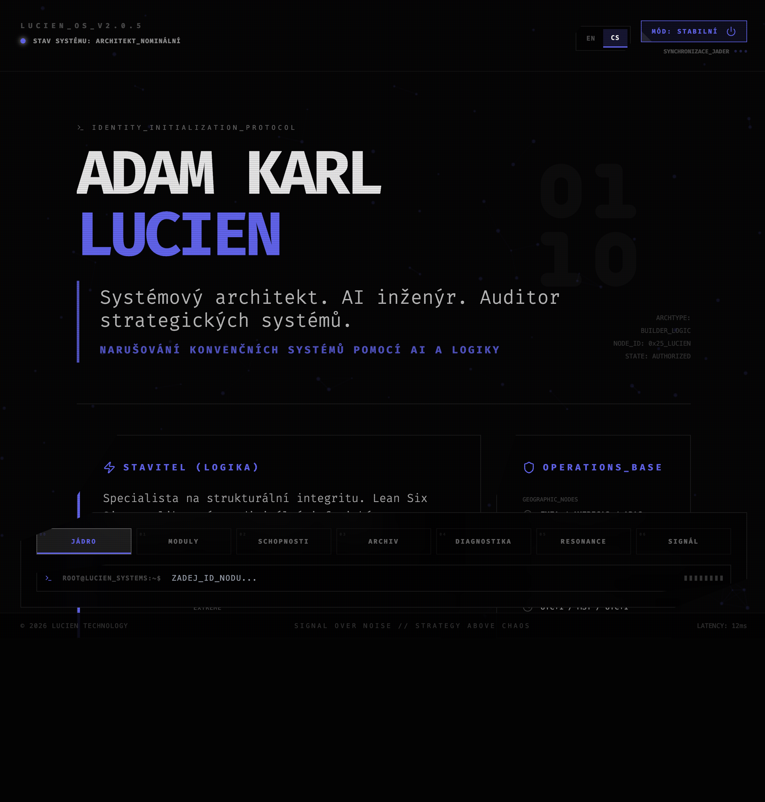

# Lucien OS v2.0

Personal digital twin interface for Adam Karl Lucien. Dual-mode (professional/raw), multilingual (CS/EN), and SEO-optimized with dedicated section URLs.

## Screenshot

## Features
- Dual-mode UI (professional/raw) with dynamic styling
- Multilingual content (Czech and English)
- Dedicated URLs per section with back/forward support
- SEO head management with canonical, hreflang, Open Graph, Twitter cards, and JSON-LD
- Sitemap and robots.txt for indexing

## Iconography
- Shield: security and system integrity
- Zap: logic/energy core emphasis
- Cpu: system architecture and computation
- Globe: global systems and governance
- Layout: product and platform architecture
- Activity: operational telemetry and performance
- Eye: surveillance and intelligence
- Bot: robotics and autonomous systems

## Routes
- Czech: `/`, `/modules`, `/capabilities`, `/archive`, `/diagnostics`, `/resonance`, `/signal`
- English: `/en`, `/en/modules`, `/en/capabilities`, `/en/archive`, `/en/diagnostics`, `/en/resonance`, `/en/signal`

## Local Development

**Prerequisites:** Node.js

1. Install dependencies: `npm install`
2. Run dev server: `npm run dev`
3. Open: `http://localhost:3000`

## License

Proprietary - see `LICENSE`.
